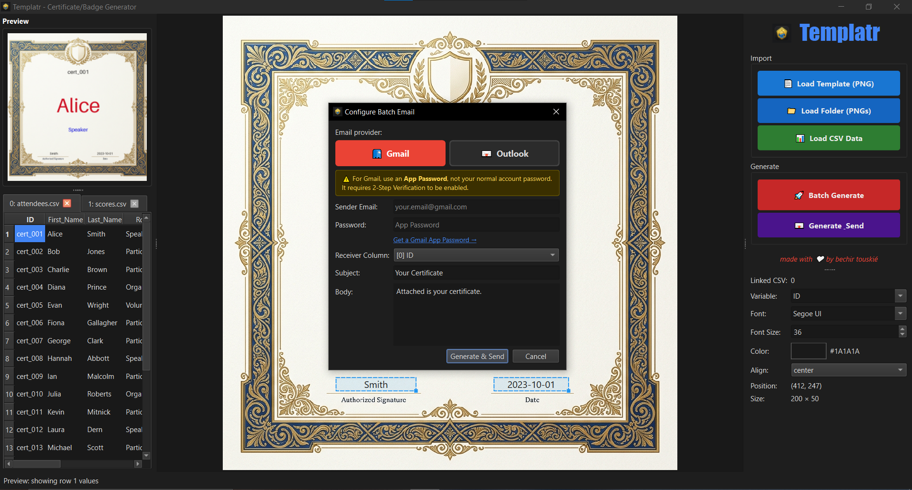
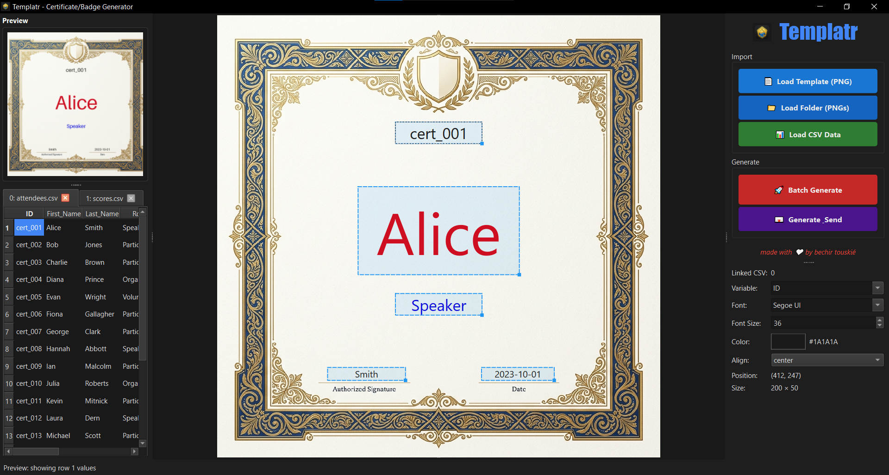

# 🖨️ Templatr — Certificate & Badge Print Generator

<p align="center">
  
</p>

<p align="center">
  <b>A sleek, Python-based desktop application for dynamically designing, generating, and batch-emailing customized certificates and badges from CSV data.</b>
</p>

<p align="center">
  
  
  
  
</p>

---

## 📖 Overview

**Templatr** is a modern desktop application that eliminates the tedious manual process of creating certificates and badges one by one. Load a PNG template, drop in text boxes, link each box to a CSV column, and generate hundreds of uniquely personalized assets in seconds — or send them directly to participants via email without ever touching local disk storage.

Designed specifically for IEEE branch events, workshops, and competitions, but fully generic for any use case requiring bulk personalized print assets.

---

## ✨ Features

| Feature | Description |
|---|---|
| 🎨 **Visual Design Canvas** | Drag-and-drop text boxes onto your template with real-time preview |
| 📊 **CSV Data Engine** | Load any CSV, map columns to text boxes, preview before batch-running |
| 🔤 **Native OS Fonts** | Access all Windows system fonts from a searchable dropdown — no manual `.ttf` browsing |
| 📐 **Smart Alignment Guides** | Snap text to canvas center or align relative to other elements |
| ⚡ **Batch Generation** | Render hundreds of personalized PNGs in seconds using Pillow |
| 📧 **Batch Email Delivery** | Send certificates directly to participants via built-in SMTP — generated in-memory, zero local storage required |
| 🌙 **Dark Mode UI** | Clean, modern dark mode using Qt Fusion palette with blue accents |

---

## 🖥️ Application Screenshots

### Main Design Canvas



The main window is divided into three panels: the **left panel** holds the preview and CSV data mapping, the **center canvas** is your drag-and-drop design area, and the **right panel** holds the box properties editor and action buttons.

### Certificate Output Preview



The **Preview Panel** renders the actual Pillow output — a pixel-accurate representation of the final exported certificate — so you can verify alignment and styling before committing to a full batch run.

---

## 🚀 Getting Started

### Prerequisites

- **Python 3.10+** (Python 3.12 recommended)
- **Windows OS** — required for native system font lookup
- A PNG image to use as your certificate/badge template
- A CSV file containing your participant data

### Installation

1. **Download the latest release** from the [GitHub Releases](https://github.com/Bechir-afk/Print-Generator/releases) page and run the standalone `.exe` — no setup required.

   > **OR**, if you prefer to run from source:

2. Clone the repository:
   ```bash
   git clone https://github.com/Bechir-afk/Print-Generator.git
   cd Print-Generator
   ```

3. Create and activate a virtual environment:
   ```bash
   python -m venv .venv
   .\.venv\Scripts\activate
   ```

4. Install dependencies:
   ```bash
   pip install -r requirements.txt
   ```

5. Launch the application:
   ```bash
   python main.py
   ```

---

## 📋 User Manual

### Step 1 — Load Your Template

Click the **"📄 Load Template (PNG)"** button in the right panel. Select the PNG image you want to use as the base for your certificates or badges. The image will appear on the central design canvas.

> **Tip:** Use a high-resolution PNG (at least 1200×800px) for best print quality output.

---

### Step 2 — Load CSV Data

Click **"📊 Load CSV Data"** to import your participant list. The application reads the header row automatically and populates the column mapping panel on the left.

Your CSV should look something like this:

```csv
First_Name, Last_Name, Email, Role
Bechir, Ben Rabia, bechir@example.com, Speaker
Ahmed, Trabelsi, ahmed@example.com, Volunteer
```

---

### Step 3 — Add Text Boxes to the Canvas

**Double-click** anywhere on the canvas to create a new text box. A draggable, resizable bounding box will appear at your cursor position.

You can add as many text boxes as your template requires (e.g., one for name, one for role, one for date).

---

### Step 4 — Configure Box Properties

With a text box selected, use the **Properties Panel** on the right to configure:

| Property | Description |
|---|---|
| **CSV Column Binding** | Link this box to a column from your CSV (e.g., `First_Name`) |
| **Font** | Select any installed Windows system font from the searchable dropdown |
| **Font Size** | Set the text size in points |
| **Color** | Pick a hex color for the text |
| **Alignment** | Set horizontal alignment: left, center, or right |

---

### Step 5 — Preview Before Generating

Click **"👁️ Preview"** to inject the first row of your CSV into the canvas. This gives you a real Pillow-rendered preview of exactly what the final PNG will look like — use this to fine-tune font sizes, positions, and colors before the full batch run.

---

### Step 6 — Generate or Send

Once satisfied with the preview, choose your output action:

#### 🖼️ Batch Generate (Save to Disk)

Click **"🔴 Batch Generate"**. The application will render a personalized PNG for every row in your CSV and save them to the output directory. Output files are named by the ID column (first CSV column by default, or user-selectable).

#### 📧 Send Emails Directly

Click **"📧 Send Emails"**. A dialog will prompt for your SMTP credentials:
- **SMTP Host**: e.g., `smtp.gmail.com`
- **Port**: `587` (TLS)
- **Email**: Your sender email address
- **Password**: Your Gmail App Password (not your account password)

> **Security Note:** Use a [Gmail App Password](https://myaccount.google.com/apppasswords) — never your main account password. Credentials are used in-session only and never stored to disk.

Each certificate is generated in-memory and attached directly to the outgoing email — no files are written to disk during this process.

---

## 🏗️ Architecture Overview

The application is structured around three independent engines:

```
┌─────────────────────────────────────────────────────────────┐
│                   1. DESIGN CANVAS (UI)                     │
│  QGraphicsView/QGraphicsScene — drag-and-drop text boxes    │
└──────────────────────────┬──────────────────────────────────┘
                           │
                           ▼
┌─────────────────────────────────────────────────────────────┐
│                   2. DATA ENGINE                            │
│  CSV parsing, column mapping, row preview injection         │
└──────────────────────────┬──────────────────────────────────┘
                           │ confirmed row list + mapping
                           ▼
┌─────────────────────────────────────────────────────────────┐
│                   3. RENDERING ENGINE                       │
│  Pillow ImageDraw — draws text onto base PNG per CSV row    │
└──────────────────────────┬──────────────────────────────────┘
                           │ in-memory PNG / saved PNG file
                           ▼
┌─────────────────────────────────────────────────────────────┐
│                   4. EMAIL ENGINE                           │
│  smtplib — attaches in-memory PNG, sends to row email col   │
└─────────────────────────────────────────────────────────────┘
```

---

## 🧰 Tech Stack

| Layer | Technology | Notes |
|---|---|---|
| Language | Python 3.12 | Stable, broad library support |
| UI Framework | PySide6 (~6.10) | Official Qt-for-Python, LGPL licensed |
| Image Rendering | Pillow 12.3.0 | `ImageDraw` + `ImageFont.truetype()` |
| Data Parsing | `csv` (stdlib) | Zero-dependency, no pandas overhead |
| Email Delivery | `smtplib` (stdlib) | In-memory attachment, no temp files |
| Packaging | PyInstaller (~6.21) | Standalone Windows `.exe` output |

---

## 📦 Releases

All new versions of **Templatr** are published to the [**GitHub Releases**](https://github.com/Bechir-afk/Print-Generator/releases) section.

Each release includes:
- ✅ A standalone Windows `.exe` (no Python installation required)
- 📋 A changelog describing what's new, fixed, or improved
- 🗂️ Source code archives (`.zip` and `.tar.gz`)

> **To get the latest version**, always check the [Releases page](https://github.com/Bechir-afk/Print-Generator/releases) rather than cloning `master` directly, as `master` may contain unreleased work-in-progress changes.

---

## 🗺️ Roadmap

- [x] v1.0 — Core canvas, CSV engine, batch generation, batch email
- [ ] v1.1 — Image variable support (per-row QR codes, headshots)
- [ ] v2.0 — Google Drive upload (per-user OAuth flow)

---

## 📄 License

This project is open-source under the [MIT License](LICENSE).

---

<p align="center">Made with ❤️ by <b>Bechir Ben Rabia</b></p>
